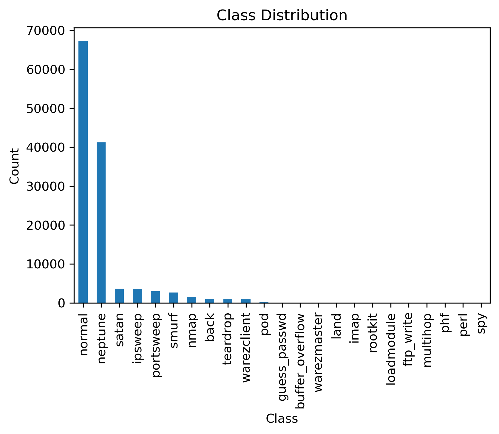
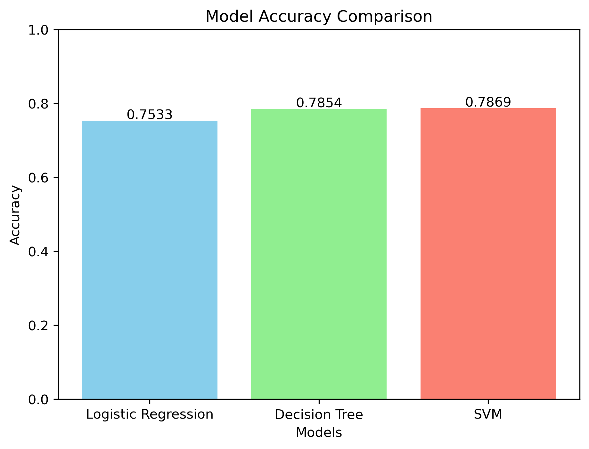
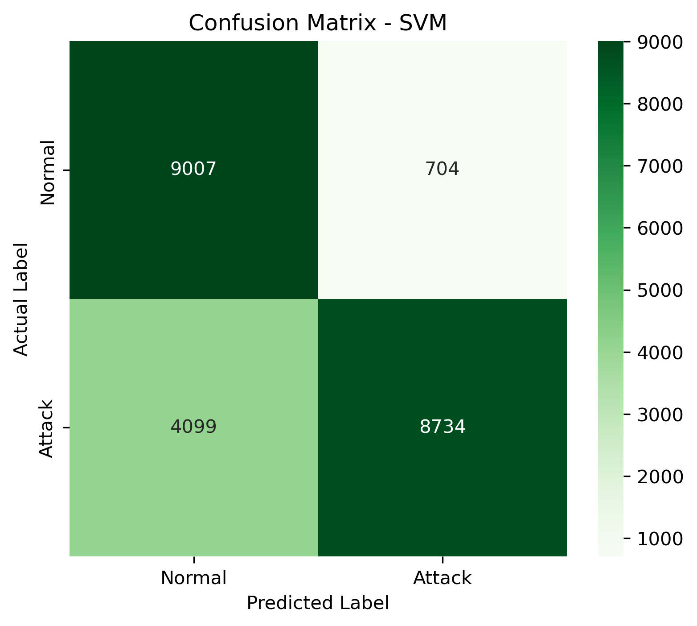

# NSL-KDD Intrusion Detection using Machine Learning

## Overview

This project presents a binary intrusion detection system using the NSL-KDD dataset. Several machine learning algorithms were implemented and compared to classify network traffic into two categories:

- Normal
- Attack

## Project Workflow

1. Load the NSL-KDD dataset
2. Perform data preprocessing
3. Encode categorical features
4. Normalize numerical features
5. Train machine learning models
6. Evaluate performance
7. Compare the models

---

## Dataset

The experiments were conducted using the **NSL-KDD** dataset, an improved version of the KDD Cup 1999 dataset widely used for intrusion detection research.

Dataset files:

- KDDTrain+.txt
- KDDTest+.txt

---

## Data Preprocessing

The following preprocessing steps were applied:

1. Assigned column names
2. Checked missing values
3. Converted attack labels into binary classes
4.  Instructions for categorical features
5. Feature alignment between training and testing datasets
6.  Standardization using StandardScaler

---

## Machine Learning Models

The following classifiers were implemented:

- Logistic Regression
- Decision Tree
- Support Vector Machine (SVM)

---

## Evaluation Metrics

The models were evaluated using:

- Accuracy
- Precision
- Recall
- F1-score
- Confusion Matrix
- Training Time

---

## Tools

- Python
- Pandas
- NumPy
- Scikit-learn
- Matplotlib
- Jupyter Notebook

---

## Project Structure

```
NSL-KDD-Intrusion-Detection
│
├── NSL_KDD.ipynb
├── README.md
├── requirements.txt
├── .gitignore
└── images
```

---
## Model Performance

Model	                Accuracy	Precision              Recall                   F1-score	    Training Time (s)
Logistic Regression	0.753282	0.917154	       0.622847	                0.741879	    3.692852
Decision Tree   	0.785442	0.964776	       0.646692	                0.774341	    2.196536
SVM	                0.786950	0.925408	       0.680589	                0.784338	    211.924959

## Visual Results

### Class Distribution



---

### Accuracy Comparison



---

### SVM Confusion Matrix



## Author

**Elham Tari /// Email: tari.elham70@gmail.com**